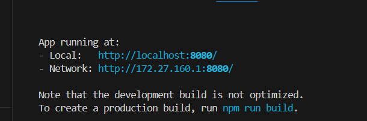

#### Graphql

Na pasta do projeto rodar o comando `npm i`

[...Curso\curso-graphql\schema-query\projeto>
]
Instalar o GraphQL import com o comando  `npm i -s graphql-import`

Para startar o projeto rodar o comando `npm start` na pasta do projeto, atraves do caminho schema-query e depois projeto 

*No code runner atalhos:* 

To run code:
use shortcut Ctrl+Alt+N

To stop the running code:
use shortcut Ctrl+Alt+M

na pasta banco-de-dados\projeto instalar a dependencia do knex com o comando `npm i -s knex mysql`

rodar na pasta: `npx knex init`

rodar o comando: `npx knex migrate: make tabela_perfis` ,

`npx knex migrate:make tabela_usuarios` ,

`npx knex migrate:make tabela_usuarios_perfis`

Documentação [Knex knexjs.org](https://knexjs.org/guide/)

Documentação GraphQL [graphql.org](https://graphql.org/learn/)

--------------------

Acessar a pasta `desafio` e rodar os comandos a seguir: 

Na pasta desafio roda ro comando `npm i`

Rodar as migrations com o comando `npx knex migrate:latest` para criar as tabelas e o comando `npx knex migrate:rollback` para remover

Rodar o comando `npm start` para startar o apolo server irá rodar na porta 4000

----------------------------------------------------------------

Acessar a pasta backend => `curso-graphql\projeto-final\backend> ` e rodar o comando `npm i`

Criar no banco o Schema `projeto-final` 

Rodar as Migrates = > `npx knex migrate:latest`

----------------------------------------------------------------
Links Úteis

https://jwt.io/

https://graphql.org/learn/execution/#root-fields-resolvers

https://www.apollographql.com/docs/apollo-server/essentials/data#context

--------------------------------------------------------------------

Acessar a pasta backend => `curso-graphql\projeto-final\frontend> `, comando `cd ..\frontend\` e rodar o comando `npm i`

Rodar o comando `npm run serve` para complilar e startar a aplicação na porta 8080 caso não esteja sendo utilizada esta porta 8080

no caso de problema seguir por este caminho:

Nesse caso será preciso habilitar o openssl legacy provider.  Pelo erro que você está recebendo, imagino que você esteja utilizando o sistema Windows, porém não consigo identificar se o terminal que você está utilizando para rodar o projeto é o cmd ou o Poweshell.

Caso você esteja usando o cmd, rode o comando `set NODE_OPTIONS=--openssl-legacy-provider` e  depois o comando `npm run serve`, e caso esteja utilizando o Powershell, rode o comando `$env:NODE_OPTIONS = "--openssl-legacy-provider"` e depois o comando `npm run serve`.

Com relação ao `package-lock.json`, este pode ser apagado sim, já que ele é criado a partir das dependências listadas no `package.json`.

